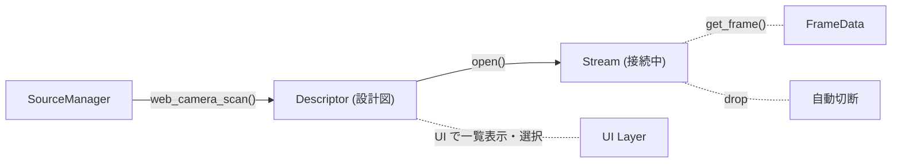

# 映像ソース（Video Source）

映像ソースの検出・管理・ストリーミングに関わる型の設計ドキュメント。

## モジュール構成

```
source/video/
├── mod.rs          型定義（SourceId, FrameData, SourceKind, Descriptor, Stream）
├── manager.rs      SourceManager（ソースの検出と管理）
└── web_camera.rs   WebCameraStream（WEBカメラの Stream 実装）
```

## 型一覧

### `SourceId`

映像ソースを一意に識別する enum。

```rust
pub enum SourceId {
    WebCamera(String),
    // 将来: Ndi(...), DesktopCapture(...), ...
}
```

- `as_string()` でテクスチャ名生成などに使える文字列表現を取得できる
- `Clone`, `Hash`, `Eq` を実装しており、`HashMap` のキーとして利用可能

### `FrameData`

映像の 1 フレームを表す。ピクセルデータは `Arc<Vec<u8>>` で保持され、複数箇所から安価に共有できる。

```rust
pub struct FrameData {
    pub pixels: Arc<Vec<u8>>,  // RGB バイト列
    pub width: u32,
    pub height: u32,
}
```

### `SourceKind`

ソース種別ごとのハードウェア固有パラメータを保持する enum。`Descriptor` のフィールドとして使われる。

```rust
pub enum SourceKind {
    WebCamera { index: CameraIndex },
    // 将来: Ndi { ... }, DesktopCapture { ... }, ...
}
```

### `Descriptor`

映像ソースの **設計図**。ストリームを開かなくても取得できるメタ情報（ID・名前・種別）を保持する。

```rust
pub struct Descriptor {
    pub id: SourceId,
    pub name: String,
    pub kind: SourceKind,
}
```

- `Clone` 可能で軽量。UI での一覧表示や選択状態の保持に使う
- `open()` を呼ぶと、`SourceKind` に応じた具体的な `Stream` を生成して返す

### `Stream`（トレイト）

ハードウェアデバイスへの接続を保持し、フレームを取得するためのトレイト。

```rust
pub trait Stream: Send {
    fn get_frame(&mut self) -> Result<Option<FrameData>, AppError>;
}
```

- `Ok(Some(frame))` — 新しいフレームが利用可能
- `Ok(None)` — まだ届いていない（ノンブロッキング）
- `Err(e)` — ストリームエラー
- drop 時にハードウェア接続が自動切断される

### `SourceManager`（`manager.rs`）

映像ソースの検出と管理を担当する。

```rust
pub struct SourceManager {
    web_cameras: Vec<Descriptor>,
}
```

| メソッド | 説明 |
|---------|------|
| `web_camera_scan()` | OS から WEB カメラを検出し、`Descriptor` のリストを更新する |
| `web_camera_list()` | 最新のスキャン結果を `&[Descriptor]` で返す |
| `open(source_id)` | 指定 ID のソースを開き、`Box<dyn Stream>` を返す |

## ライフサイクル



1. `SourceManager::web_camera_scan()` で OS に問い合わせ、`Descriptor` 一覧を取得
2. UI 側は `Descriptor`（Clone 可能）を使って一覧表示・選択
3. ユーザーが選択したソースに対して `Descriptor::open()` を呼び、`Box<dyn Stream>` を取得
4. 毎フレーム `stream.get_frame()` で映像データを取得
5. 不要になった `Stream` は drop するだけで接続が自動切断

## 新しい映像ソースの追加方法

例: NDI ソースを追加する場合

1. `SourceId` に `Ndi(String)` バリアントを追加
2. `SourceKind` に `Ndi { ... }` バリアントを追加
3. `source/video/ndi.rs` を作成し、`NdiStream` 構造体と `impl Stream` を実装
4. `Descriptor::open()` の match に `SourceKind::Ndi` 分岐を追加
5. `SourceManager` にスキャンロジックを追加
