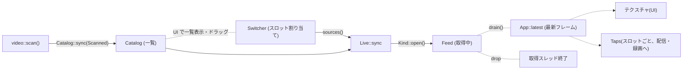

# 映像ソース（Video Source）

映像ソースの検出・管理・ストリーミングに関わる型の設計ドキュメント。

映像と音声は `source/` の共通の骨格(`Source` / `Catalog` / `Open` / `Feed` / `Live`)で扱う。
骨格そのものは[音声ソース](audio-source.md)と共通なので、ここでは共通部分と映像固有の部分を説明する。

## モジュール構成

```
source/
├── mod.rs        共通の型(SourceId, Origin, Source, Open)
├── catalog.rs    Catalog(利用可能なソースの一覧)
├── live.rs       Live(いま開いているソースの集合)
├── feed.rs       Feed / Producer(取得スレッド → エンジンスレッドの経路)
└── video/
    ├── mod.rs      Frame, Kind, scan()
    ├── camera.rs   Webカメラ(nokhwa)
    └── screen.rs   画面キャプチャ(xcap)
```

## 共通の型

### `SourceId`

ソースを一意に識別するID。`SourceId::new(scheme, key)` で `"<scheme>:<key>"` の形に作る。

| 方式 | 例 |
|---|---|
| Webカメラ | `camera:<表示名>_<index>` |
| 画面キャプチャ | `screen:<モニターID>` |

- `Display` を実装し、ログやテクスチャ名(`source:<id>`)に使う
- `Clone`, `Hash`, `Eq` を実装しており、`HashMap` のキーとして利用可能

### `Origin`

ソースが一覧に載った経緯。`Catalog::sync` がどの範囲を入れ替えてよいかを決める。

| 値 | 意味 | 消えるとき |
|---|---|---|
| `Scanned` | デバイスのスキャンで見つかった | 再スキャンで見つからなかったとき |
| `Manual` | ユーザーや起動設定が追加した | 明示的に削除したとき |
| `Discovered` | SAP の告知で見つかった(音声のみ) | 告知が途絶えたとき |

### `Source<K>`

ソースの情報。ストリームを開かなくても分かるものだけを持ち、軽量で `Clone` できる。
`K` は映像なら `video::Kind`、音声なら `audio::Kind`。

```rust
pub struct Source<K> {
    pub id: SourceId,
    pub name: String,
    pub kind: K,
    pub origin: Origin,
}
```

### `Open`（トレイト）

種別からデータの経路 `Feed` を開く。開くと取得処理(スレッドやOSのコールバック)が動き出し、
返した `Feed` を drop すると止まる。

```rust
pub trait Open {
    type Output;
    fn open(&self) -> Result<Feed<Self::Output>>;
}
```

### `Feed<T>` / `Producer<T>`

取得処理からエンジンスレッドへデータを渡す経路。`Feed::new(capacity)` で作る。
`Feed::spawn(capacity, run)` を使うと、取得処理 `run` を専用スレッドで動かして受信口を返す。

- 容量を超えたら**古いものから捨てる**(ライブ用途では遅延の積み上がりより最新への追従を優先する)
- `Feed::try_iter()` で届いているデータを古い順に全て取り出す(ブロックしない)
- 失敗はデータとは別に「直近のエラー」として持ち、次に成功すると消える(`Feed::error()`)
- `Feed` が drop されると `Producer::send` / `Producer::is_open` が `false` を返すので、取得処理はそこで終了する
- `Feed::with_guard(x)` で、`Feed` が生きている間だけ保持する資源(OSのストリームなど)を持たせられる

### `Catalog<K>`

利用可能なソースの一覧。IDの重複は持たない。

| メソッド | 説明 |
|---|---|
| `get(id)` / `name(id)` | 参照・表示名(無ければ `"Unknown"`) |
| `insert(source)` | 追加する。同じIDがあれば何もしない |
| `remove(id)` | 削除する |
| `sync(origin, fresh)` | `origin` 由来のソースを `fresh` の内容に入れ替える。他の由来で同じIDがあればそちらを優先する |

### `Live<T>`

いま開いているソースの集合。`sync(catalog, wanted)` で、`wanted` のソースだけを開いた状態に保つ。

- `wanted` に無くなったソースは `Feed` を drop して閉じる
- 新しく必要になったソースは `catalog` から `Open::open` で開く
- 開くのに失敗したソースはエラーを持ったまま、使われなくなるまで再試行しない
- `drain(id)` でデータを取り出し、`errors()` で失敗しているソースと理由を得る

## 映像固有の型

### `Frame`

映像の1フレーム。RGB8 の画像。

```rust
pub type Frame = image::RgbImage;
```

### `Kind`

映像ソースの種別と、開くのに必要な情報。`Open` を実装する。

```rust
pub enum Kind {
    Camera(nokhwa::utils::CameraIndex), // Webカメラ
    Screen(u32),                        // 画面キャプチャ(モニターID)
}
```

### `scan()`

接続されている映像ソース(Webカメラ + モニター)を全て探し、`Origin::Scanned` の `Source` を返す。

## 各方式

| 方式 | モジュール | 取り込み |
|---|---|---|
| Webカメラ | `camera.rs` | 専用スレッドで `nokhwa` から連続取得。1280x720 以上で最高解像度を要求する |
| 画面キャプチャ | `screen.rs` | 専用スレッドで `xcap` からモニター全体を約15fps(66ms間隔)で取得 |

`Feed` の容量は2(`FEED_CAPACITY`)。使うのは最新の1枚だけなので最小限にしている。

## ライフサイクル


```mermaid
graph LR
    SCAN["video::scan()"] -->|"Catalog::sync(Scanned)"| C["Catalog (一覧)"]
    C -.-|"UI で一覧表示・ドラッグ"| SW["Switcher (スロット割り当て)"]
    SW -->|"sources()"| L["Live::sync"]
    C --> L
    L -->|"Kind::open()"| F["Feed (取得中)"]
    F -.-|"drain()"| LT["App::latest (最新フレーム)"]
    LT -.-> T["テクスチャ(UI)"]
    LT -.-> P["Taps(スロットごと、配信・録画へ)"]
    F -.-|"drop"| X["取得スレッド終了"]
```

1. 起動時とソース一覧の **Rescan** で `video::scan()` を呼び、`Catalog::sync(Origin::Scanned, ..)` で一覧を更新する
2. UI のソース一覧からマルチビューのスロットへドラッグすると、`Switcher` に `SourceId` が割り当てられる
3. エンジンスレッドが 10ms ごとに `Live::sync(&catalog, switcher.sources())` を呼び、どこかのスロットに出ているソースだけを開く
4. 同じくエンジンスレッドが、各ソースの最新フレームを `App::latest` に取っておく。各スロットに出ているフレームは配信・録画への受け渡し口(`output::Taps`)にも置く
5. UI スレッドは描画のたびに、`latest` のうち変わったものだけを egui のテクスチャに上げる
6. どのスロットからも外れたソースは `Live::sync` で `Feed` が drop され、取得スレッドが止まる

## 新しい映像ソースの追加方法

例: NDI ソースを追加する場合

1. `source/video/ndi.rs` を作り、次の2つを `pub(super)` で実装する
   - `scan() -> Vec<Source<Kind>>`: `SourceId::new("ndi", ..)` で ID を付け、`Origin::Scanned` で返す(スキャンできない方式なら不要)
   - `open(..) -> Result<Feed<Frame>>`: `Feed::spawn(FEED_CAPACITY, ..)` の中で取得し、`producer.send(..)` が `false` を返したら終了する
2. `video/mod.rs` の `Kind` に `Ndi { .. }` バリアントを追加する
3. `impl Open for Kind` の match に `Kind::Ndi` の分岐を追加する
4. `video::scan()` に `ndi::scan()` を連結する
5. `ui/widget.rs` の `Chip::video` に表示名(`NDI` など)を追加する
